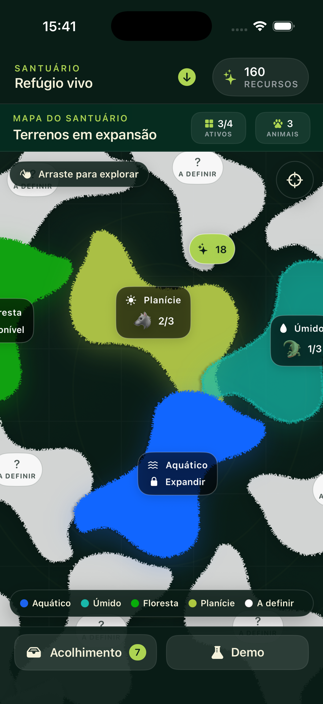

# POC Santuário (iPhone)

POC nativa em SwiftUI para iOS 17+ que valida somente o ciclo de gestão do santuário do jogo: terrenos, acolhimento, capacidade, produção passiva, coleta, expansão e melhorias.



## O que está incluído

- mapa bidimensional do santuário, navegável em todas as direções, com lotes orgânicos repetidos e rotacionados;
- quatro cores de bioma: azul para `Aquático`, verde-água para `Úmido`, verde para `Floresta` e verde amarelado para `Planície`;
- lotes brancos representam expansões cujo tipo ainda não foi definido;
- três terrenos iniciais e um lote bloqueado para testar expansão;
- Central de acolhimento para adicionar, guardar e acomodar animais de demonstração;
- regra de uma única espécie por terreno e vários indivíduos até a capacidade;
- geração de um único recurso principal enquanto o app está aberto;
- acúmulo offline local, limitado pela configuração provisória;
- coleta por terreno e coleta geral;
- oito trilhas canônicas de melhoria com nomes específicos por bioma;
- cinco melhorias funcionais nesta POC: produção-base, intervalo geral, eficiência offline, capacidade e intervalo offline;
- persistência local em JSON via `UserDefaults`;
- Laboratório da POC para adicionar recursos/animais, acelerar o relógio, simular uma hora offline e restaurar o cenário.

## Executar

1. Abra `SantuarioPOC.xcodeproj` no Xcode 26.
2. Selecione o scheme `SantuarioPOC` e um iPhone Simulator.
3. Rode com `⌘R`.

O projeto não precisa de conta, permissões, backend ou conexão com a internet.

Como o `xcode-select` desta máquina aponta para Command Line Tools, a verificação por terminal usa:

```sh
DEVELOPER_DIR="/Applications/Xcode 26.app/Contents/Developer" \
xcodebuild \
  -project "SantuarioPOC.xcodeproj" \
  -scheme SantuarioPOC \
  -destination "platform=iOS Simulator,name=iPhone 17" \
  CODE_SIGNING_ALLOWED=NO \
  test
```

## Valores provisórios da POC

Os valores abaixo são parâmetros de demonstração, não decisões finais do jogo:

- capacidade-base: `3` indivíduos;
- intervalo-base: `10 s`;
- eficiência offline inicial: `35%`;
- limite offline: `4 h`;
- saldo inicial: `160` recursos;
- expansão do lote aquático: `120` recursos;
- cenário inicial com três terrenos liberados e um lote aquático bloqueado;
- espécies, produção-base, custos e curvas das melhorias;
- bioma Principal como única compatibilidade aceita;
- movimentação gratuita e Central de acolhimento temporária;
- coleta manual por terreno ou geral, transferindo apenas valores inteiros e preservando a fração acumulada;
- trilhas começam no nível `0` na POC antes da primeira compra e podem chegar ao nível canônico máximo `10`;
- nome e ícone genéricos de `Recursos`.

As melhorias de coleta dobrada, reprodução e bônus de bioma Principal aparecem na interface, mas ficam desabilitadas porque dependem de decisões ainda abertas.

## Fora do escopo

Esta POC não implementa login, perfil, mapa de exploração/geolocalização, passos, spawns, encontro, resgate, cestas, inventário geral, XP, upgrades do jogador, backend, reprodução ou animais se movimentando pelo terreno.

SwiftUI puro foi usado como renderer do protótipo. Os modelos e a lógica de produção estão separados da interface, permitindo substituir a camada visual por SpriteKit futuramente sem levar regras de negócio para a cena.
